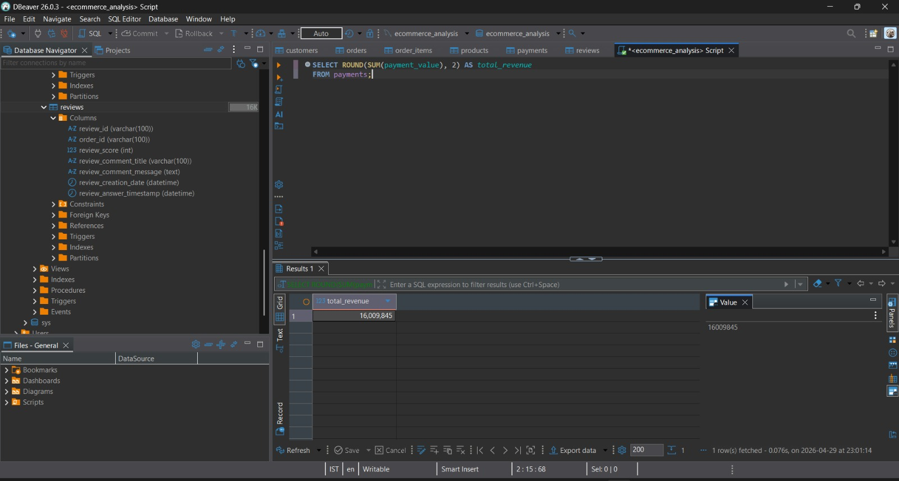
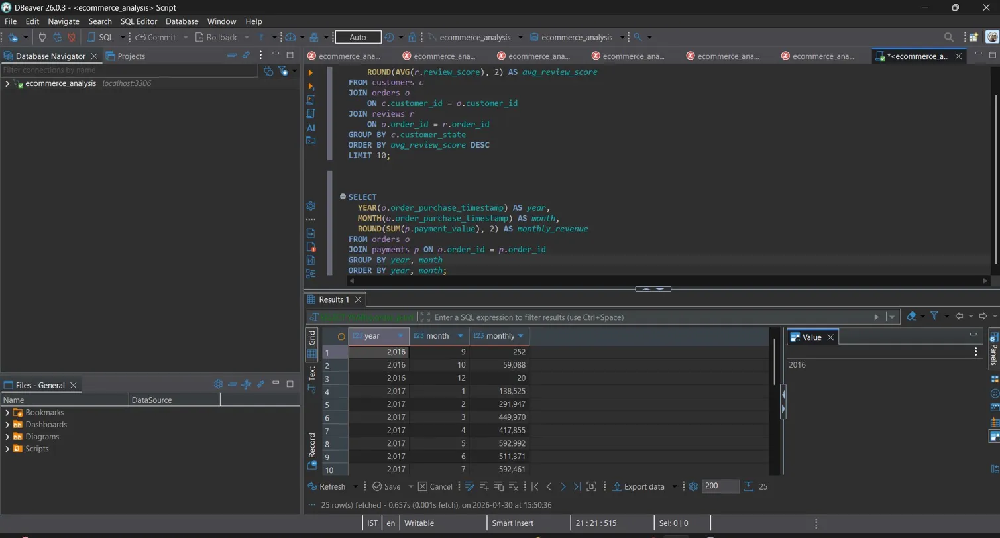
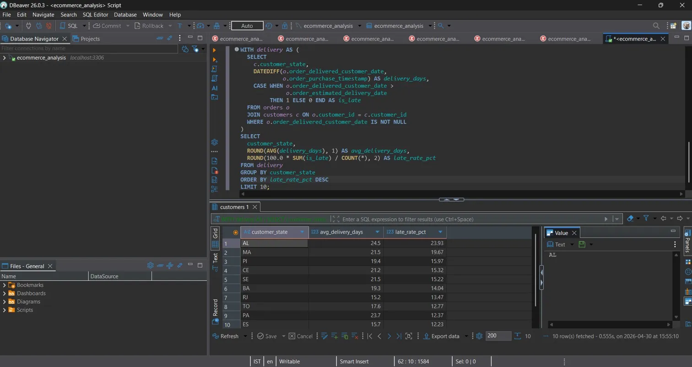
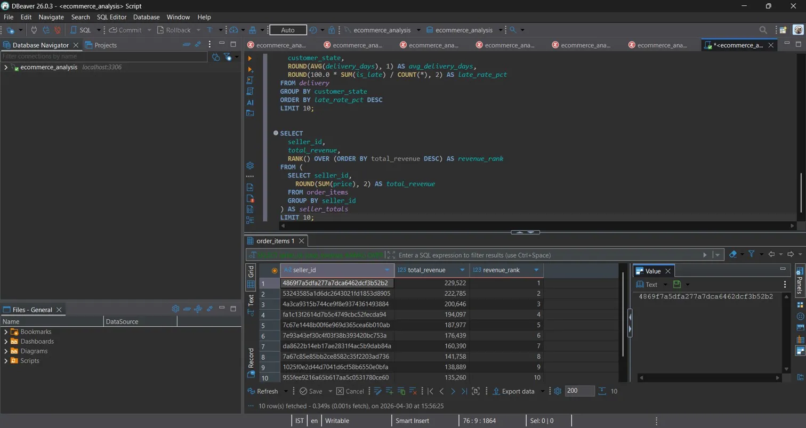

# E-Commerce Sales Analysis — SQL Project

End-to-end SQL project analyzing 100K+ e-commerce orders to uncover revenue trends, delivery inefficiencies, and seller performance using advanced SQL techniques.

> Analyzed 100K+ orders across 6 relational tables using MySQL to derive actionable business insights.

---

## Key Metrics

| Metric                 | Value                  |
| ---------------------- | ---------------------- |
| Total Revenue          | $16,009,845            |
| Average Review Score   | 4.09 / 5.0             |
| Total Orders Analyzed  | 100K+                  |
| Top State by Customers | São Paulo — 41,746     |
| Top State by Revenue   | São Paulo — $5,999,054 |
| Database Tables Used   | 6                      |

---

## Key Insights

* **São Paulo dominates** — SP accounts for 41,746 customers and $5.99M in revenue, far ahead of any other state
* **Amazonas leads satisfaction** — Highest average review score (4.29) despite lower order volume
* **Alagoas has worst delivery performance** — 23.93% late deliveries with an average of 24.5 delivery days
* **Revenue peaked in mid-2017** — Monthly revenue reached ~$592K, with strong cumulative growth crossing $16M by late 2018
* **Top sellers dominate revenue** — Rank #1 seller generated $229K, revealing significant revenue concentration at the top

---

## Queries Covered

| #  | Business Question                    | SQL Concept                        |
| -- | ------------------------------------ | ---------------------------------- |
| 01 | Total revenue from payments          | `SUM()`                            |
| 02 | Average review score                 | `AVG()`                            |
| 03 | Best-selling products by order count | `GROUP BY`, `ORDER BY`             |
| 04 | Customer distribution by state       | `JOIN`                             |
| 05 | Revenue by state (3-table join)      | `JOIN` across 3 tables             |
| 06 | Customer satisfaction by state       | `JOIN`, `AVG()`                    |
| 07 | Monthly revenue trend                | `YEAR()`, `MONTH()`                |
| 08 | Cumulative revenue (running total)   | `CTE` + `SUM() OVER`               |
| 09 | Late deliveries by state             | `CTE` + `CASE WHEN` + `DATEDIFF()` |
| 10 | Seller rankings by revenue           | `RANK() OVER`                      |

---

## SQL Concepts Used

**Basic**

* `SELECT`, `WHERE`, `GROUP BY`, `ORDER BY`, `LIMIT`
* Aggregate functions — `SUM()`, `AVG()`, `COUNT()`, `ROUND()`

**Intermediate**

* `INNER JOIN` across multiple tables
* Date functions — `YEAR()`, `MONTH()`, `DATEDIFF()`

**Advanced**

* CTEs — `WITH ... AS`
* Window functions — `RANK() OVER`, `SUM() OVER`
* `CASE WHEN` conditional logic
* `PARTITION BY`

---

## Sample Query — Cumulative Revenue

```sql
WITH monthly AS (
  SELECT
    YEAR(o.order_purchase_timestamp)  AS year,
    MONTH(o.order_purchase_timestamp) AS month,
    ROUND(SUM(p.payment_value), 2)    AS revenue
  FROM orders o
  JOIN payments p ON o.order_id = p.order_id
  GROUP BY year, month
)
SELECT
  year,
  month,
  revenue,
  ROUND(SUM(revenue) OVER (ORDER BY year, month), 2) AS cumulative_revenue
FROM monthly
ORDER BY year, month;
```

---

## Sample Outputs






---

## Project Structure

```
ecommerce-sql-analysis/
│
├── datasets/               # Raw CSVs from Kaggle (not uploaded — see link below)
├── queries/
│   └── all_queries.sql     # All 10+ queries used in this analysis
├── screenshots/
│   ├── erd_diagram.png
│   ├── 01_total_revenue.png
│   ├── 02_average_review_score.png
│   ├── 03_best_selling_products.png
│   ├── 04_customers_by_state.png
│   ├── 05_revenue_by_state.png
│   ├── 06_customer_satisfaction_by_state.png
│   ├── 07_monthly_revenue.png
│   ├── 08_cumulative_revenue.png
│   ├── 09_late_deliveries_by_state.png
│   └── 10_seller_rankings.png
└── README.md
```

---

## How to Run

1. Download the dataset from Kaggle — Brazilian E-Commerce Public Dataset by Olist

2. Create the database:

```sql
CREATE DATABASE ecommerce_analysis;
```

3. Import each CSV file as a table using DBeaver's import wizard or `LOAD DATA INFILE`

4. Open `queries/all_queries.sql` in DBeaver and execute

---

## Tools Used

| Tool    | Purpose                     |
| ------- | --------------------------- |
| MySQL   | Database engine (localhost) |
| DBeaver | SQL editor + ERD generation |
| Kaggle  | Dataset source              |

---

## Project Checklist

* [x] Downloaded and explored the Olist dataset
* [x] Set up local MySQL database
* [x] Imported all 6 tables and drew the ERD
* [x] Wrote 5+ basic queries (SELECT, WHERE, GROUP BY)
* [x] Wrote 10+ intermediate queries (JOINs, aggregations)
* [x] Wrote 5+ advanced queries (CTEs, window functions)
* [x] Extracted and documented key business insights
* [x] Captured screenshots of all query outputs
* [x] Structured project folder for GitHub

---

## Why This Project Matters

SQL is tested in almost every data analyst interview. This project demonstrates:

* Working with real-world, messy relational data at scale
* Strong SQL fundamentals through to advanced window functions
* Business thinking — questions are framed around actual business problems, not just syntax
* Clear documentation and reproducible structure

---

*Dataset: Brazilian E-Commerce Public Dataset by Olist — Kaggle*
